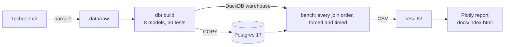

# Join Order Bench

[](https://github.com/johnha912/join-order-bench/actions/workflows/ci.yml)

**Does the database pick the right join order, and what does a wrong one cost?**

A reproducible benchmark that forces every possible join order of four TPC-H chain
queries on **DuckDB** and **Postgres**, times each one, and compares three planners
against that ground truth: a textbook dynamic program, a greedy heuristic, and the
engine's own optimizer.

**[Interactive report →](https://johnha912.github.io/join-order-bench/)** (Plotly, `docs/index.html`)

**Nguyen "John" Ha** · solo project · v2, October 2026

> **About this version.** v1, [JoinOrderOptimizationDP](https://github.com/johnha912/JoinOrderOptimizationDP),
> was a two-person CS 5800 Algorithms class project (Nguyen Ha and Yanglin Hu, Summer 2026). It
> proved a dynamic program optimal *for its cost model* on paper.
> **v2 is my own independent rebuild, done alone after the course ended**, to test whether that
> model survives contact with real database engines. I designed and wrote the data pipeline, the
> dbt warehouse and tests, the DuckDB/Postgres benchmark harness, the Plotly report and the CI.
> Three small modules carry over from v1 unchanged, as credited [below](#credits).

---

## Results (TPC-H SF 1)

Each planner's runtime as a multiple of the fastest join order found by brute force
(1.00× = picked the best one). Median of 5 warm runs, one laptop, DuckDB 1.5 and Postgres 17.

| Chain | Join orders | Postgres: DP | Postgres: own optimizer | Postgres: worst | DuckDB: DP | DuckDB: own optimizer | DuckDB: worst |
|---|---|---|---|---|---|---|---|
| brass_parts_europe_1995 | 42 | **1.00×** | 1.42× | 1.66× | 1.41× | **1.01×** | 1.76× |
| asia_suppliers_1994 | 14 | **1.00×** | 1.10× | 2.10× | 1.14× | **0.99×** | 1.47× |
| min_cost_supplier | 14 | **1.00×** | 1.14× | 2.17× | **1.11×** | 1.15× | 1.64× |
| returned_items | 5 | **1.02×** | 1.04× | 1.04× | **1.00×** | 1.21× | 1.68× |

What the numbers say:

1. **On Postgres, the DP's choice was the fastest order in 3 of 4 chains and beat Postgres's own
   optimizer on all four, by up to 1.42×.** The DP was fed exact filtered row counts, which is an
   advantage over Postgres's histogram estimates, so this is an upper bound on what better
   statistics would buy.
2. **On DuckDB the DP's cost model is the weak link.** It counts intermediate rows only and
   ignores scan and hash-build cost, so on the 6-table chain it picks an order 1.41× slower than
   the best. DuckDB's own optimizer lands within 1% of brute force on the two largest chains.
   The model ranks join orders well on Postgres (Spearman ρ 0.60–0.96) and poorly on DuckDB's
   two largest chains (ρ 0.13 and 0.34).
3. **Row estimates are within 1% on most sub-chains and 2× too low on `returned_items`.**
   TPC-H only flags line items as returned when they were received before mid-1995, so
   `l_returnflag = 'R'` is correlated with the order-date filter. The model assumes the two
   filters are independent, which is exactly the assumption that breaks on real data.

Every one of the 75 forced plans per engine returned the same row count as the engine's own
plan, which the benchmark asserts on every run.

---

## Pipeline



| Stage | What it does | Why it matters |
|---|---|---|
| Generate | TPC-H at any scale factor, one parquet file per table | Raw landing zone; nothing large is committed |
| dbt build | Loads parquet into a DuckDB warehouse; tests every primary key (unique, not null) and every foreign key (relationships) | The cost model assumes each child row matches exactly one parent. These tests are that assumption, enforced before any number is produced |
| Load Postgres | Same tables over `COPY`, primary keys added, `ANALYZE` | A second engine with a different optimizer |
| Bench | Forces each of the Catalan(n−1) join trees (DuckDB: `join_order` optimizer off; Postgres: `join_collapse_limit = 1`), median of repeated warm runs; then the engine's own plan | Every plan must return the same row count, or the run fails |
| Report | Static HTML with interactive Plotly charts | Opens from disk, hosts on GitHub Pages |

## Run it

Requires [uv](https://docs.astral.sh/uv/) and, for Postgres, Docker.

```bash
uv sync --all-extras
docker compose up -d                              # optional: Postgres 17 on :5432
uv run joinbench all --sf 1 --postgres            # drop --postgres for DuckDB only
```

Steps can also run one at a time: `joinbench generate | dbt | bench | report`.
Postgres connection: `JOINBENCH_PG` (libpq string), default
`host=localhost port=5432 dbname=postgres user=postgres password=postgres`.

```bash
uv run pytest      # DP == brute force on 300 random chains; every join order returns the same answer
uv run ruff check
```

CI runs lint, tests, and the whole pipeline end to end at SF 0.01 against a Postgres service.

## Layout

```
src/joinbench/
  dp.py, cost_model.py, heuristics.py   v1 code, unchanged except one import
  chains.py     the four chain queries, every join tree, tree -> SQL
  bench.py      DuckDB / Postgres runners, forced-order timing, cardinality check
  pipeline.py   CLI: generate -> dbt -> load postgres -> bench -> report
  report.py     Plotly HTML report
dbt/            8 staging models + key/foreign-key tests
tests/          pytest
results/        CSV output of the last run (committed)
docs/           the report (GitHub Pages)
```

## The chains

| Chain | Tables | Filters |
|---|---|---|
| brass_parts_europe_1995 | part – lineitem – orders – customer – nation – region | brass parts, 1995 orders, European customers |
| asia_suppliers_1994 | region – nation – supplier – lineitem – orders | Asian suppliers, 1994 orders |
| min_cost_supplier | region – nation – supplier – partsupp – part | join path of TPC-H Q2 |
| returned_items | nation – customer – orders – lineitem | join path of TPC-H Q10 |

The cost model sees only what an optimizer would: filtered single-table row counts and
`1 / |parent table|` per foreign key, assuming filters are independent.

## Credits

v2 was built solely by Nguyen Ha.

Carried over unchanged from v1 (except one import line): `dp.py` and `cost_model.py` by
Nguyen Ha, and `heuristics.py` by Yanglin Hu.

MIT license.
